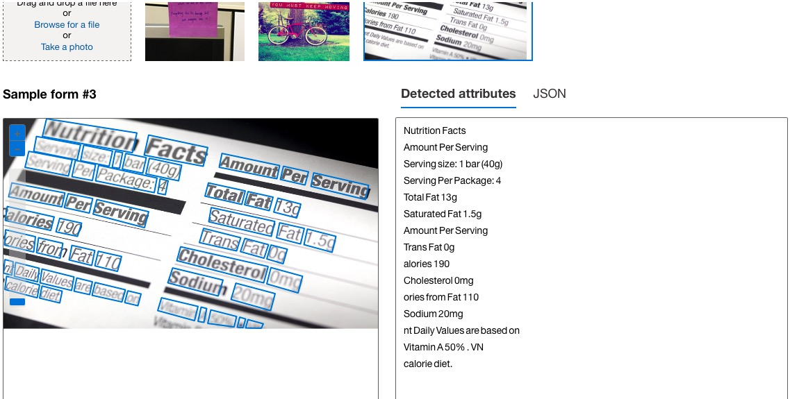

# Vision-ocr-lab

## Descrição
Testando o Azure Vision Studio, aqui na modalidade OCR, para extrar texto de imagens.

## Pré-requisitos
- Python 3.6 ou superior
- Conta no Azure
- Chave de acesso ao Azure Vision Studio
- Google Colab

## Passo a passo

Chaves em funcionamento.

    

Localizando as chaves e o endpoint no Azure.

    

Configurando e aceitando os termos do Azure.

    

Visualizando e testando o funcionamento no Azure Vision Studio.

    

Exemplos de códigos para implementação.

    

Visualizando e testando o funcionamento no Azure Vision Studio.

    

